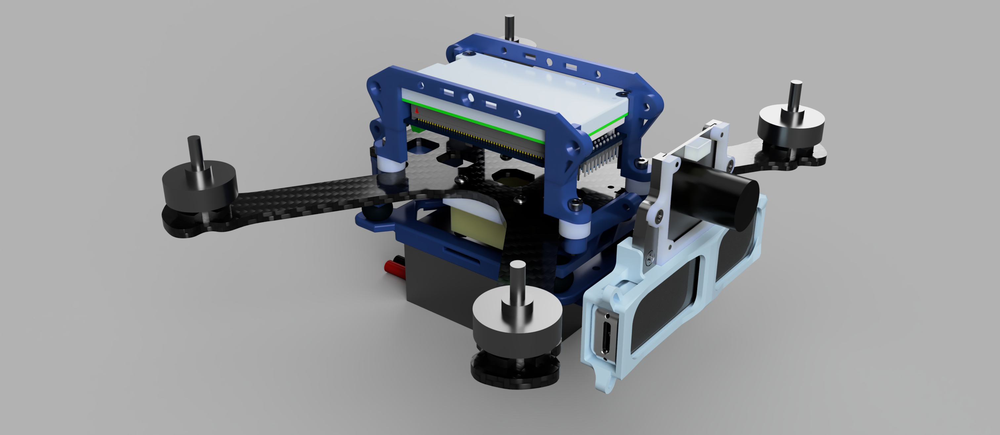

# drone_agi

 For more detailed documentation, please visit our [Wiki](https://github.com/byang12159/drone_agi/wiki)

Drone Build Using the Agilicious Framework: \
Philipp Foehn, Elia Kaufmann, Angel Romero, Robert Penicka, Sihao Sun, Leonard Bauersfeld, Thomas Laengle, Giovanni Cioffi, Yunlong Song, Antonio Loquercio, Davide Scaramuzza, "Agilicious: Open-Source and Open-Hardware Agile Quadrotor for Vision-Based Flight", AAAS Science Robotics, 2022, Video, Bibtex

