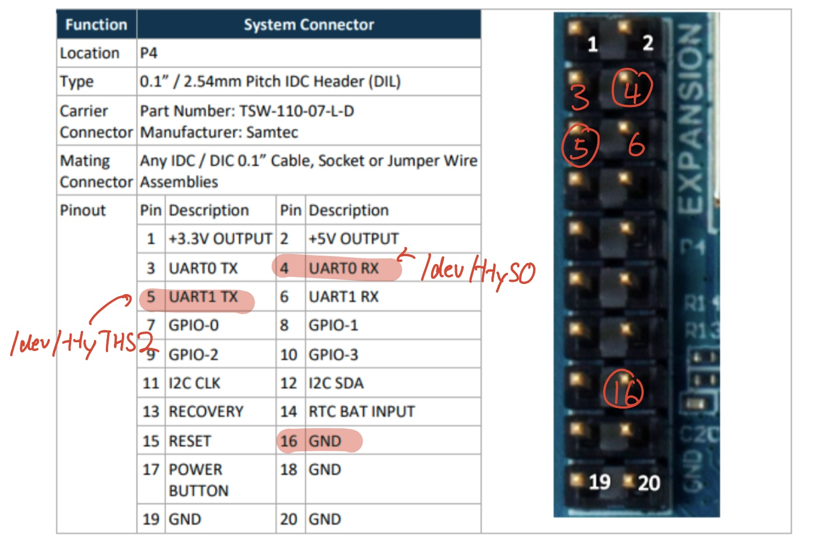
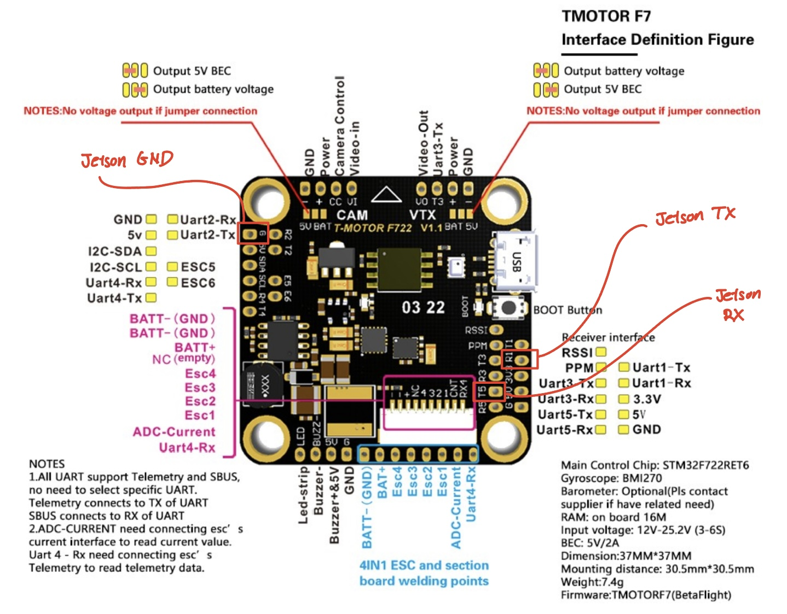
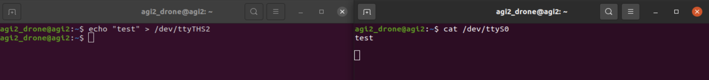
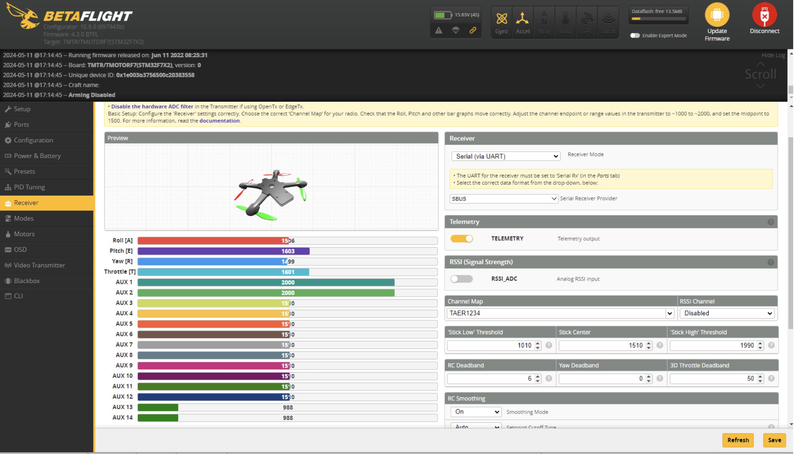

# drone_agi

Drone Build Using the Agilicious Framework: \
Philipp Foehn, Elia Kaufmann, Angel Romero, Robert Penicka, Sihao Sun, Leonard Bauersfeld, Thomas Laengle, Giovanni Cioffi, Yunlong Song, Antonio Loquercio, Davide Scaramuzza, "Agilicious: Open-Source and Open-Hardware Agile Quadrotor for Vision-Based Flight", AAAS Science Robotics, 2022, Video, Bibtex

## Drone Build BOM:
| Item     | Quantity |   Notes |
|----------|----------|----------|
|  M3x16mm Socket Screw | Row 1, Col 2 |  |
|  M3 Hex Nut | Row 1, Col 2 |  |
| M3x Self Tapping Countersunk Screw | Row 2, Col 2 | For 3D printed parts |
| Row 3, Col 1 | Row 3, Col 2 | Row 3, Col 3 |

## Setting Up Connection between Jetson TX2 & F7 Flight Controller

### 1. Physical Wiring
3 wires need to be connected between the TX2 & FC, with example provided below. For the F7 FC you can use other UART ports, but not UART 4 because UART 4 RX is already being used by the ESC.

### 2. Software Configuration on TX2
In SBUS.yaml:
In betaflight.launch: 

### 3. Software Configuration on Betaflight Configurator
Install betaflight configurator in Windows and plug in flight controller directly to device.

In Ports tab:
1. For corresponding UART # RX used: 
1. For corresponding UART # TX used: 

### 4. Debugging
#### 4.1 To test TX2 UART port has correct addresses:
Short circuit the corresponding pins of interest (connect pins via 1 wire, ex UART0 RX and UART1 TX). 
Open two terminals, one responsible for receiving data and another for sending data. 

#### 4.2 To confirm connection between TX2 and FC:
Arm drone from Agilicious GUI. Successful connection should result in changing throttle, yaw, pitch, roll values in Betaflight configurator receiver tab. 

